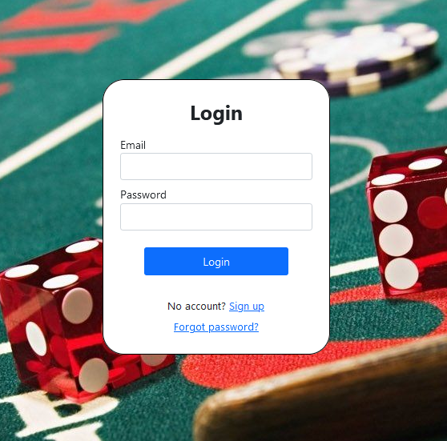
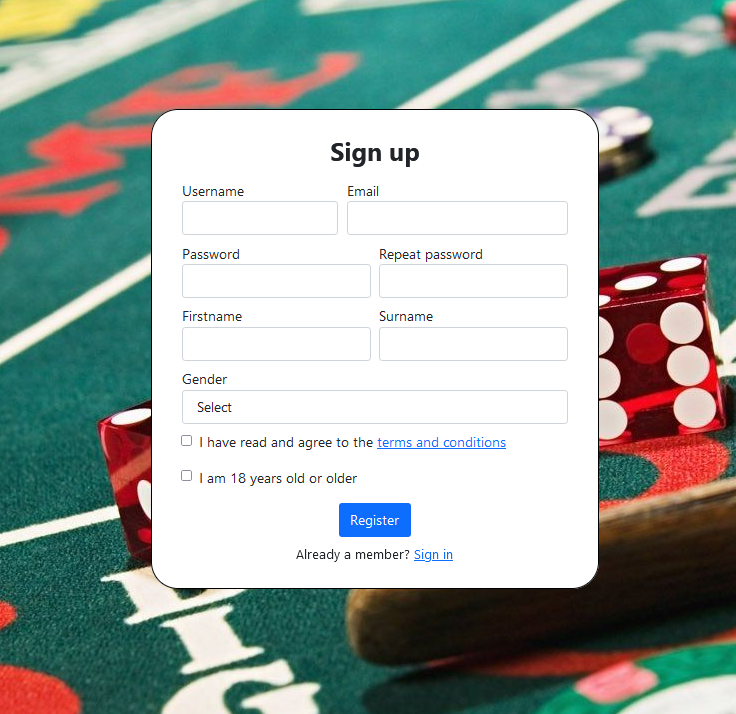
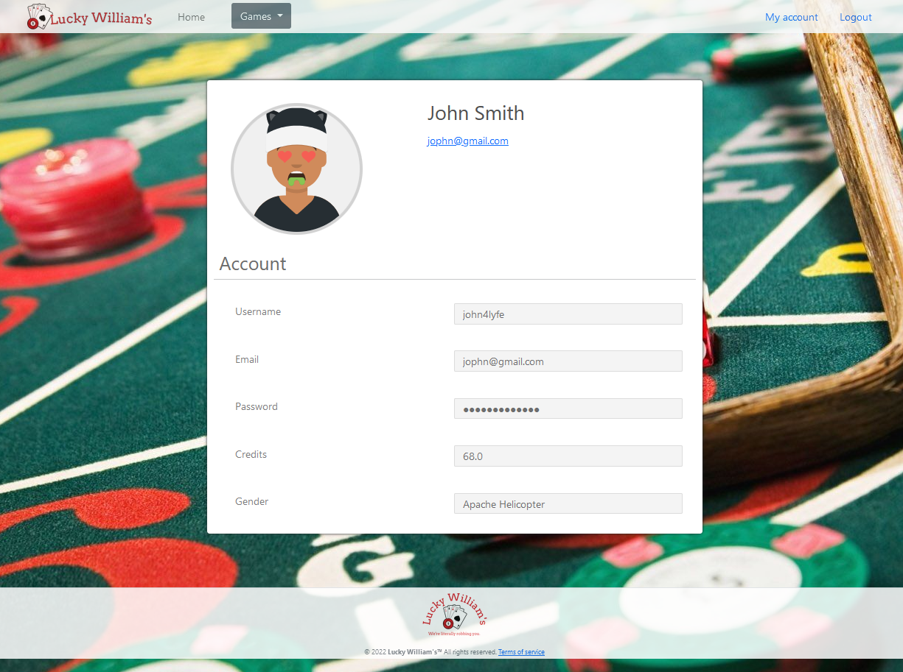
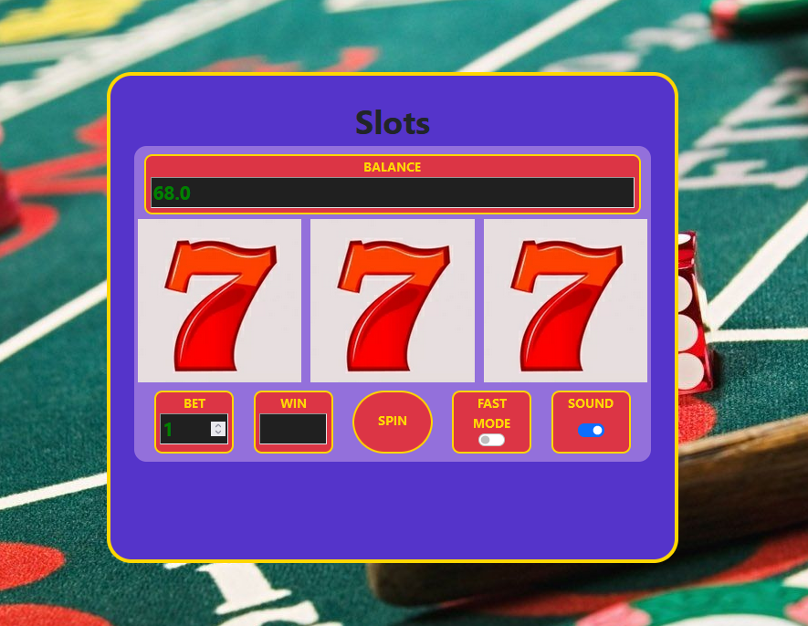
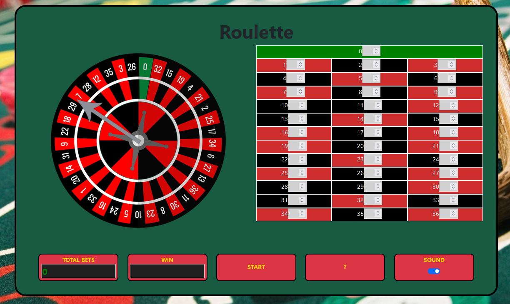
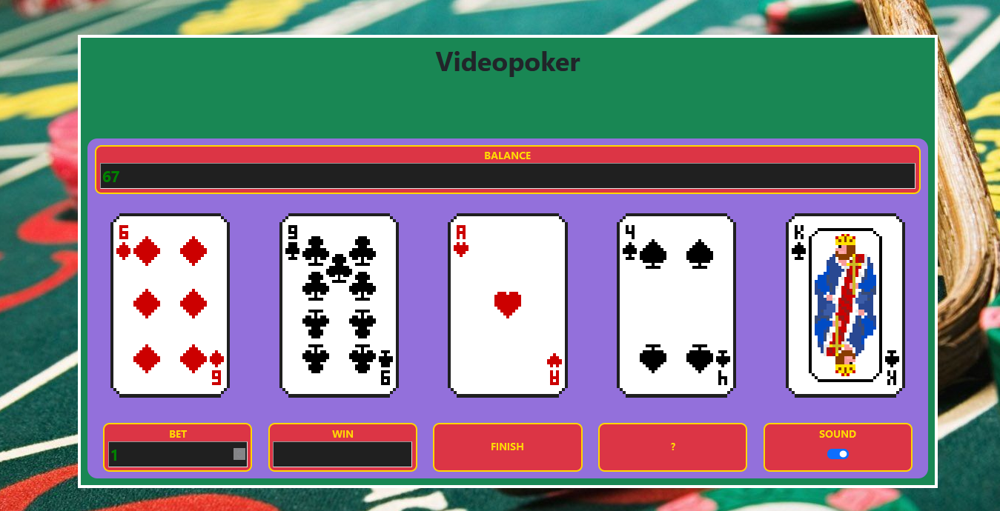

# This was my school project with spring boot & mysql database

## Some preview images

  
  
   
  
   
  
  
  

  
  
  
* Before starting the program you need to define database details in application.properties

* In order to test the mail services you need to install and have maildev running: https://github.com/maildev/maildev

* In order to test admin privileges you need the admin role, in mysql workbench run:
'UPDATE login_user SET ROLE = 'ADMIN' WHERE id = 1;'
note that this requires a reauthentication if you're currently logged in with that account.
